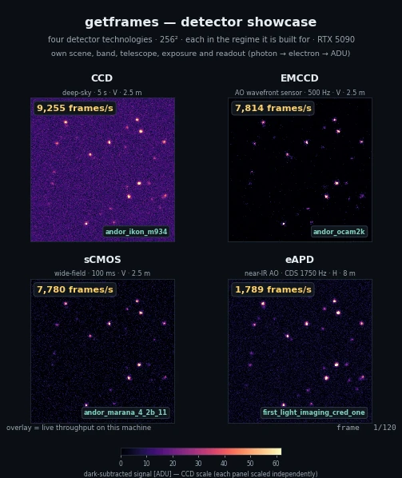

# getframes

[](https://github.com/jacotay7/getframes/actions/workflows/ci.yml)
[](https://pypi.org/project/getframes/)
[](https://pypi.org/project/getframes/)
[](https://jacotay7.github.io/getframes/)
[](LICENSE)

**Documentation: [jacotay7.github.io/getframes](https://jacotay7.github.io/getframes/)**

**Realistic synthetic camera frames for scientific imaging pipelines.**

<p align="center">
  
</p>

`getframes` generates the frames a real detector would have produced: the full
**photon → electron → ADU** signal path for **CCD**, **CMOS**, **EMCCD**,
**eAPD** and **sCMOS** sensors, with auditable noise physics (read noise, dark
current, shot noise, fixed-pattern non-uniformity, a unified stochastic gain
stage, clock-induced charge, nonlinearity, cosmic rays). It produces **dark**,
**bias** and **flat** frames, and renders **star fields** through a PSF and
telescope into a realistic science frame — so you can build and validate
image-processing pipelines against ground truth. It runs on NumPy by default and
switches to CUDA (via CuPy) with a single argument.

## Install

```bash
pip install getframes            # CPU (NumPy + SciPy + astropy)
pip install 'getframes[gpu]'     # + CuPy for CUDA 12.x
pip install -e '.[dev]'          # from a clone, for development
```

## Quickstart

```python
import getframes as gf

cam = gf.Camera.from_preset("andor_ikon_m934")  # 21 presets, or your own CameraConfig
frame = cam.dark_frame(exposure=60.0, temperature=-60.0, seed=0)

frame.data  # (1024, 1024) array of ADU
frame.stats()  # {'mean': ..., 'median': ..., 'std': ..., 'min': ..., 'max': ...}
frame.metadata  # camera/exposure/temperature provenance

scene = gf.Scene(  # render a sky, then expose it
    shape=(256, 256),
    optics=gf.Telescope(
        aperture_diameter_m=2.5,
        throughput=0.3,
        plate_scale_arcsec_per_pixel=0.4,
        band=gf.Bandpass.johnson("V"),
    ),
    psf=gf.MoffatPSF(fwhm_arcsec=1.1, beta=3.0),
    sources=[gf.PointSource(x=128, y=128, magnitude=20.0)],
    sky=gf.Sky(surface_brightness_mag_arcsec2=21.0),
)
frame = cam.with_config(resolution=(256, 256)).observe(scene, exposure=300.0, seed=0)

import cupy as cp  # and the same path on a GPU

cam = gf.Camera.from_preset("andor_ocam2k", device="gpu", precision="float32")
rate = cp.full(cam.resolution, 2.0e6, dtype=cp.float32)  # photons/s/pixel
frame = cam.expose(rate, exposure=1.0e-3, seed=0)  # CuPy ADU, no host copy
```

See **[Getting started](https://jacotay7.github.io/getframes/guides/getting-started/)**
for the full walkthrough,
**[Observing scenes](https://jacotay7.github.io/getframes/guides/scenes/)** for
sources, PSFs and telescopes,
**[Camera presets](https://jacotay7.github.io/getframes/guides/presets/)** for the
preset library, and
**[The noise model](https://jacotay7.github.io/getframes/guides/noise-model/)** for
the physics behind every stage.

## Benchmarks

Warm bulk-frame throughput on an AMD Ryzen 9 9950X3D and an NVIDIA RTX 5090
(`float32`, truth enabled, persistent camera, device-resident input/output, no
host transfers). The raw artifact and its invocation are
[versioned with the benchmarks](benchmarks/device-results.json):

| Workflow | Native shape | CPU (frames/s) | GPU (frames/s) | Speedup |
| --- | ---: | ---: | ---: | ---: |
| Pyramid WFS CMOS | 80×80 | 5,240 | 11,514 | 2.20× |
| Shack-Hartmann WFS CMOS | 160×160 | 1,386 | 11,471 | 8.27× |
| OCAM2K EMCCD | 240×240 | 357 | 8,045 | 22.53× |
| SAPHIRA eAPD | 256×320 | 280 | 7,497 | 26.74× |
| Large science CMOS | 1024×1024 | 31 | 1,453 | 47.21× |

Higher is better; CUDA was synchronized around every timed region and
construction was excluded. Even the smallest case reaches about 2×, while larger
arrays and gain-stage detectors expose much more parallel work. Reproduce the
table with

```bash
python benchmarks/bench_devices.py --seconds 2 --warmup 10 --device both
python benchmarks/run.py                    # the CPU hot-path sweep
```

See the [full snapshot](benchmarks/device-results.md) and the
**[GPU guide](https://jacotay7.github.io/getframes/guides/gpu/#reference-throughput)**
for the methodology.

## Features

- **Five detector families** — CCD, CMOS, EMCCD, eAPD and sCMOS, from a library
  of sourced **[presets](https://jacotay7.github.io/getframes/guides/presets/)**
  (`andor_ikon_m934`, `andor_ocam2k`, `leonardo_saphira`,
  `first_light_imaging_cred_one`,
  `andor_marana_4_2b_11`, `zwo_asi2600mm`, …) or any `CameraConfig` you define.
- **Auditable noise physics** — dark current vs. temperature, shot noise, a
  unified stochastic gain stage (EM and avalanche) with realistic excess noise,
  clock-induced charge, per-pixel sCMOS read noise, polynomial nonlinearity,
  saturation and quantisation, each a small documented pure function in
  **[the noise model](https://jacotay7.github.io/getframes/guides/noise-model/)**.
- **Detector realism** — CTI, blooming, IPC, kTC/reset noise, multi-amplifier
  readout, cosmic-ray tracks, defect and structured-bias maps, vignetting and
  radial distortion.
- **Fixed patterns that behave like silicon** — PRNU, DSNU, hot pixels, defects
  and amplifier structure are keyed on `fixed_pattern_seed`, so they repeat in
  every frame and are genuinely removable by a master frame.
- **Scenes** — point, extended and catalog sources, Gaussian/Moffat/Airy/array
  PSFs, a `Telescope` with Vega (Johnson) and AB (ugriz, Gaia, 2MASS) bandpasses,
  extinction, graybody thermal background, WCS pixel↔world, and light curves.
- **Calibration & ground truth** — master bias/dark/flat builders and a
  `calibrate` reduction that closes the
  **[raw → reduced → truth loop](https://jacotay7.github.io/getframes/guides/calibration/)**.
- **Observations** — `Observation` drives time series with jitter, drift, dither
  and persistence, carrying per-frame
  **[truth](https://jacotay7.github.io/getframes/guides/time-series/)**.
- **Spectral mode** (opt-in) — QE curves, relative or absolute SEDs, transmission
  products and wavelength-resolved exposure; see
  **[Spectral mode](https://jacotay7.github.io/getframes/guides/spectral/)** and
  **[Radiometry & the infrared](https://jacotay7.github.io/getframes/guides/radiometry/)**.
- **Analysis on real data too** — aperture sums, centroids, photon-transfer
  curves, independent-stack characterization, and reset-aware nondestructive-ramp
  analysis run on measured detector frames as readily as on simulated ones.
- **Scale & datasets** — a float32 fast path, vectorised multi-source rendering,
  a streaming raw+truth `dataset` generator and a `getframes` CLI; see
  **[Scale & datasets](https://jacotay7.github.io/getframes/guides/datasets/)**.
- **GPU-optional** — every camera takes `device="gpu"` (CuPy) and keeps the
  detector path and truth arrays device-resident. CPU and GPU have independent
  RNG streams, so a `seed` repeats exactly on a fixed backend while parity across
  backends means matching statistics, not identical pixels.
- **Reproducible and typed** — all randomness flows through a camera-owned seeded
  generator, never global state; `mypy --strict` passes; every public name is
  frozen under [SemVer](https://jacotay7.github.io/getframes/stability/) as of 2.0.
- **Validated** — noise models are checked against published forms in CI; see
  **[Validation](https://jacotay7.github.io/getframes/guides/validation/)**.

See the **[API reference](https://jacotay7.github.io/getframes/reference/)** for
every public function and class, the
**[runnable examples](examples/)** for PTC, exposure planning, AO limiting
magnitude, transit photometry and detector realism, and the
**[roadmap](https://jacotay7.github.io/getframes/roadmap/)** for what is next.

## Contributing

Contributions — especially new camera presets — are welcome. See
[CONTRIBUTING.md](CONTRIBUTING.md). Run the checks locally with:

```bash
ruff check . && ruff format --check . && mypy && pytest
```

## License

MIT — see [LICENSE](LICENSE).
